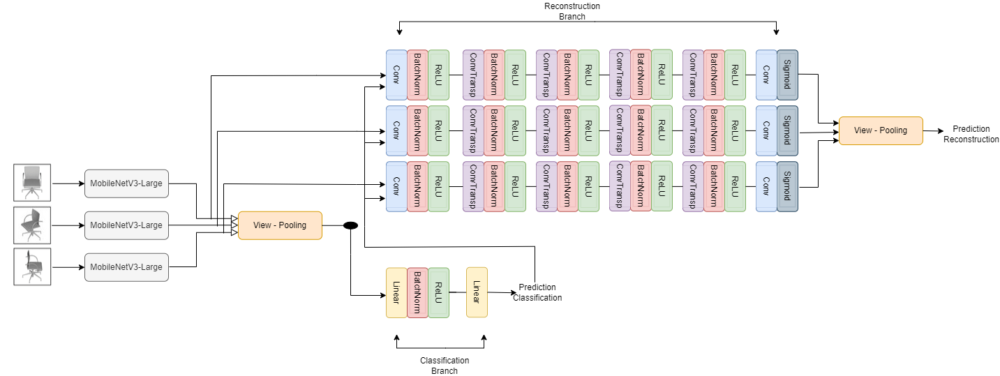
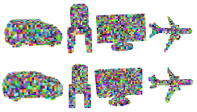

## Multi-View RGB-based Recognition and Reconstruction
The optimal form of the input representation to the Neural networks, which are ultimately learning to recognize 3D objects, has not been yet determined. Point clouds, meshes, and grids seem straightforward choices to take so that the incoming and outgoing data of the models reside both in the 3D domain. However, recent works have shown that sampling a 3D shape as multiple 2D RGB views can have numerous benefits for 3D recognition tasks. In our work, we explore and extend such methodologies. We provide an open-source implementation of MVCNN in PyTorch and extend the architecture with an additional Reconstruction head that is able at inference time to reconstruct a 3D object using only 3 input RGB views. We also conduct an extensive study on various augmentation techniques and propose a view-mixing approach to curate problematic cases in which two classes are mistaken with each other more often. Multiple experiments show that our approach can achieve a competitive classification accuracy of 95.23% on a subset of the ShapeNet dataset with 13 classes, while also being very efficient, as it is trained using low-end GPU hardware. The implemented Reconstruction head achieves an IoU of 40.53.

### Architecture 
---
We input 3 randomly sampled views to the pre-trained MobileVNetV3-Large. Then, our network splits into two heads used for classification and reconstruction respectively. The classification head is efficiently implemented by adding 2 linear layers.

 

  

### Reconstructions
---
Our method can reconstruct the original 3D object fairly well while using only 3 views during training and inference time.

 

  

### Datasets
---
1. RGB views: http://cvgl.stanford.edu/data2/ShapeNetRendering.tgz
2. Voxel grid: http://cvgl.stanford.edu/data2/ShapeNetVox32.tgz

### Authors
---
* Christos Georgakilas  
* Vassilina Papadouli  
* Panagiotis Petropoulakis

:zap: <em>Equal contribution</em>

##### Αcknowledgements
---
Prof. Dr. Angela Dai @ 3D AI Lab  
Prof. Dr. Matthias Nießner @ Visual Computing Lab   
Department of Informatics  
Technical University of Munich (TUM)  
3D AI Lab: https://www.3dunderstanding.org/  
Visual Computing & Artificial Intelligence Lab: http://niessnerlab.org/
